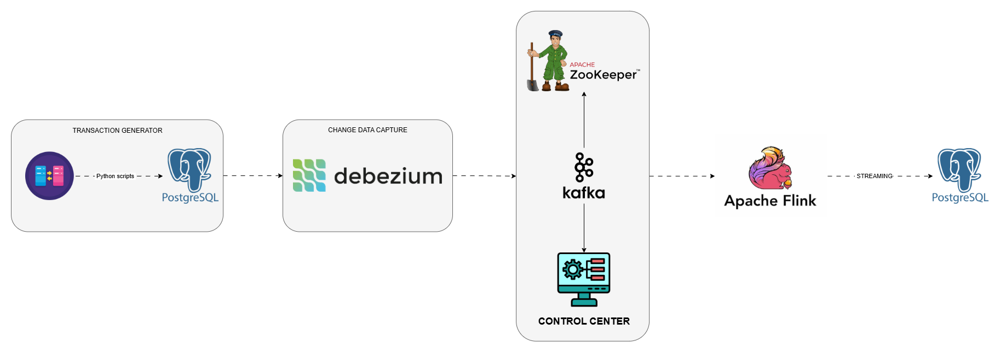

# Apache Flink Streaming Data To Database With ChangeDataCapture (Debezium)

This repository contains an Apache Flink application for real-time data built using Docker Compose to
orchestrate the necessary infrastructure components, including Apache Flink and Postgres. The
application processes transaction data from Kafka, performs aggregations, and stores the results in Postgres for further analysis.

## Table of contents

- [Requirements](#Requirements)
- [Architecture](#Architecture)
- [Installation and Setup](#Installation)
- [Usage](#Usage)
- [Application](#Application)
- [Components](#Components)
- [Structure](#Structure)
- [Configuration](#Configuration)
- [License](#License)

## Requirements

- Docker
- IDE (Intellij, Pycharm, ...)
- OS (WSL if use Windows)
- Apache Flink

## Architecture



## Installation

1. Download Flink from (https://flink.apache.org/downloads/).
2. Clone this repository. 
3. Navigate to the repository directory.
4. Run ```docker-compose up -d --build``` to start the required services (Kafka, Debezium, Zookeeper, Control Center, Postgres).
5. Exec the Debezium container and paste content from `exec-postgres-connector.properties` and then run to config Postgres-Connector.

## Usage

To use the project, follow these steps:

1. Ensure all Docker containers are up and running.
2. Open `command line` and run ```wsl -d Ubuntu-24.04``` to open the virtual machine.
3. Start Flink cluster with command ```~/Flink/flink-{version}/bin/start-cluster.sh```.
4. Run ```mvn clean && mvn package``` to compile the application.
5. Run ```~/Flink/flink-{version}/bin/flink run -c CdcPipeline.DataStreamJob target/``` to start the FlinkCommerce application provided in this repository to perform real-time streaming transactions.
6. The Sales Transaction Generator run ```python ./TransactionGenerator/main.py``` to generate the sales transactions into Postgres.
7. Review data pipeline

## Application

- The ```DataStreamJob``` class within the `CdcPipeline` package serves as the main entry point for the Flink application. 
- The application consumes financial transaction data from Kafka, performs various transformations, and
stores aggregated results in Postgres.

## Components

#### Apache Flink
- Sets up the Flink execution environment.
- Connects to Kafka as a source for financial transaction data.
- Extract, transforms, and load aggregations on transaction data streams.

#### Debezium
- Capture all changes using the CDC mechanism.
- Load transaction data into Kafka-cluster.

#### Postgres
- Stores transaction data and aggregated results in tables target_transactions.

#### Kafka
- Storage transaction data with queue.

## Structure

- DataStreamJob.java: Contains the Flink application logic, including Kafka source setup, stream processing, transformations and sinks for Postgres.
- Deserializer, Dto, and utils packages: Include necessary classes and utilities for deserialization, data transfer objects, and JSON conversion.
- TransactionGenerator: Generate financial transaction data.
- Dockerfile and docker-compose: Store config file and config docker container.

## Configuration

- Kafka settings (bootstrap servers, topic, group ID) are configured within the Kafka source setup.
- Postgres connection details (URL, username, password) are defined in the jdbcUrl, username, and password variables.

## License

This project is licensed under the [MIT License](LICENSE).

## Contact

- Email: hiepgaden@gmail.com
- Portfolio: (https://hiepphde.github.io/)
